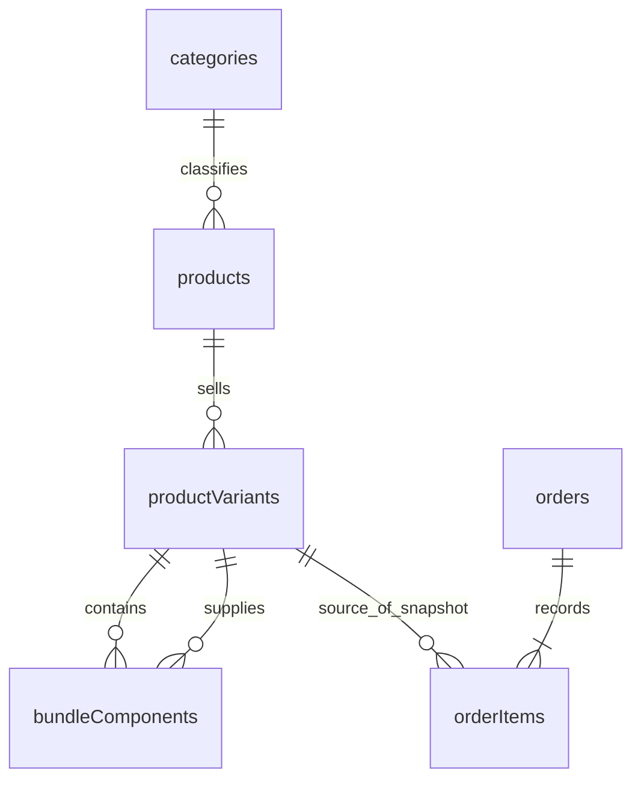

> **Status: superseded.** The product-variants implementation and its pricing/stock contracts have been removed at the owner's request. The design below is historical, not an implementation plan. Current products contain details, category, images, and status only. See `CodingRules.md` for the current code map.

# Product System Design

Status: proposed implementation contract, based on local source reviewed on
2026-09-05. Read with [OrdersSystemDesign.md](./OrdersSystemDesign.md).
This document does not claim these features are already implemented.

## 1. The decision

A **product** is the page the customer browses. A **variant** is the exact thing
they buy. **Options** describe the choices distinguishing those variants.
Every product has exactly one category and at least one variant when published.
A product without choices has one default variant; the admin need not see that
implementation detail.

Use four catalog tables: existing `categories` and `products`, plus
`productVariants` and `bundleComponents`. Embed bounded option definitions in
the product. Variants own prices and inventory. Orders reference variants and
copy the purchased facts into their own snapshots.

This follows a common commerce model: Shopify connects variant choices to SKU,
price, media, and inventory. It is an established pattern, not a requirement to
copy Shopify's entire schema.
[Source: Shopify ProductVariant](https://shopify.dev/docs/api/admin-graphql/latest/objects/productvariant).

The following are app decisions: one category per product, one store currency,
one stock pool, bounded options, and fixed bundles. “Universal” means arbitrary
product names and choice dimensions; it does not promise every subscription,
rental, manufacturing, or warehouse workflow at once.

## 2. What goes where

| Merchant intent                         | Representation                               | Example                               |
| --------------------------------------- | -------------------------------------------- | ------------------------------------- |
| Organize the catalog                    | One required `categoryId`                    | Clothing                              |
| Describe the common item                | Product fields                               | Classic T-Shirt, description, gallery |
| Choose a finite version                 | Options and variant selections               | Color: Red; Size: Medium              |
| Price/count an exact version            | Variant                                      | Red / Medium, EUR 24.99, 12 in stock  |
| Sell without choices                    | Default variant with empty selections        | A mug with one design                 |
| Sell a prepacked box with its own stock | Ordinary variant                             | A sealed six-pack counted as one box  |
| Sell existing items from shared stock   | Bundle variant and component links           | Two mugs plus one tea tin             |
| Collect customer text                   | Bounded customization field, copied to order | Engraving: “For Ana”                  |
| Describe a fact that is not a choice    | Description initially                        | Care instructions, country of origin  |

An option named “Bundle” or “Pack size” is only a label. Component links define
what a bundle consumes.

Do not create `sizes`, `colors`, `materials`, category-specific product tables,
or a global attribute registry. Options can be named Size, Color, Finish, Scent,
Capacity, License, or any other merchant-defined label. Different categories use
the same schema; changing category does not regenerate variants.

## 3. Catalog tables

### `categories`

Keep the existing flat table and required `products.categoryId`. Creation and
publication require an active category. Archiving a category hides its category
navigation page and prevents new assignments; it does not silently archive its
products or prevent direct purchase. Existing products can retain it until
reassigned. Hard deletion requires that no product references the category.

### `products`: shared content and bounded definitions

| Field                            | Contract                                                                                                                                           |
| -------------------------------- | -------------------------------------------------------------------------------------------------------------------------------------------------- |
| `name`, `slug`, `description`    | Existing content; enforce slug uniqueness transactionally and keep it stable when the name changes.                                                |
| `categoryId`                     | Exactly one existing category.                                                                                                                     |
| `imageKeys`                      | Ordered gallery; first image is cover. Resolve delivery URLs in queries.                                                                           |
| `status`                         | `draft`, `active`, `archived`. Only active products are public.                                                                                    |
| `productType`                    | Keep existing `standard` or `bundle`. Stock composition, not category or presence of options.                                                      |
| `options`                        | Bounded array of `{ key, label, values: [{ key, label }] }`. Array order controls display.                                                         |
| `customizationFields`            | Optional bounded array of `{ key, label, required, maxLength }` for plain text only. Empty by default.                                             |
| `minPriceMinor`, `maxPriceMinor` | Derived range across active variants, including temporarily sold-out variants. Both `null` when none are active. Never authoritative admin inputs. |

Reuse existing name, description, storage, and image-count validation limits.
Retire duplicated stored `images` URLs after migrating valid storage keys;
retain resolved URLs in query responses for UI consumers. Do not reinterpret
legacy URLs as object keys without checking them.

Option/value keys are stable opaque identifiers, independent of labels and
translations. Preserve the existing `{ key, label }` shape. Use UUIDs rather
than timestamps for new editor keys. Renaming “Medium” to “M” or reordering
Color and Size must not change variant identity.

### `productVariants`: every sellable choice

| Field                  | Contract                                                                                                                                   |
| ---------------------- | ------------------------------------------------------------------------------------------------------------------------------------------ |
| `productId`            | Parent product; checked on every scoped write.                                                                                             |
| `sku`                  | Server-generated unique stable string. Show under advanced details; merchant entry is unnecessary. Variant ID is the application identity. |
| `optionValues`         | Map from option key to value key: exactly one valid value per option, no extra keys. Empty object for the default variant.                 |
| `optionKey`            | Server-computed canonical combination for indexed lookup/uniqueness.                                                                       |
| `status`               | `active` or `archived`; parent status still gates publication.                                                                             |
| `priceMinor`           | Actual selling price, nonnegative safe integer in store currency.                                                                          |
| `compareAtPriceMinor`  | Optional display reference price, strictly greater than selling price. Not an additional checkout discount.                                |
| `imageKeys`            | Optional gallery override. Missing/empty means inherit product gallery.                                                                    |
| `inventory`            | Discriminated value: `{ mode: 'tracked', onHand, reserved }`, `{ mode: 'untracked' }`, or `{ mode: 'components' }`.                        |
| `archivedOptionLabels` | Optional option/value label snapshot on retirement, keeping admin history readable after definitions change.                               |

Standard products use tracked or untracked inventory. Bundle products use
component inventory for every variant and require component rows. A bundle
parent never has a second independent stock counter.

Canonicalize combinations as JSON-encoded `[optionKey, valueKey]` pairs sorted
by option key. The default combination is `[]`. Do not join arbitrary strings
with `=` and `|`: delimiters can collide and display order can change.
Enforce unique `(productId, optionKey)` across active and archived variants.
An old combination is restored, not duplicated. Indexes alone do not enforce
uniqueness: check in the same mutation that writes. Likewise for SKU and slug.

There is no `hasVariants`, product base price, product stock, or persisted
“simple versus variable” flag. Every active variant has an explicit price.
The editor's bulk price field copies values into rows rather than establishing
a second source of truth through price inheritance.

### `bundleComponents`: exact composition

| Field                | Contract                                                |
| -------------------- | ------------------------------------------------------- |
| `bundleVariantId`    | Bundle variant being sold.                              |
| `componentVariantId` | Exact standard variant supplied; never just product ID. |
| `quantity`           | Positive integer units needed per one parent bundle.    |

Enforce a unique bundle/component pair. A bundle has 1–20 distinct components;
duplicate selections combine quantities. Disallow self-reference and nested
bundles, avoiding recursive stock graphs and cycles. Referenced variants and
their products must exist and be active for new purchases.

Each bundle variant has its own composition and selling price. The price is not
automatically the sum of component prices. Shopify also separates parent bundle
pricing from inventory derived from components.
[Source: variant fixed bundles](https://shopify.dev/docs/apps/build/product-merchandising/bundles/add-variant-fixed-bundle).

Example: “Tea gift set” has Size: Small / Large. Small contains one mug and one
tea tin; Large contains two mugs and one tea tin. The admin selects exact
components for each variant. The customer selects Small or Large normally.

For “Single / Three-pack” sharing loose-unit stock, both bundle variants can
reference the same standard unit variant, with quantities 1 and 3. A sealed box
counted separately remains a standard variant instead.

Fixed bundles are included. “Build your own box” with arbitrary component picks
is a future configurator, not something a label or unvalidated JSON can provide.

## 4. Limits and invariants

Start with existing configuration: at most 3 option dimensions, 20 values per
dimension, and 100 active variants per product. These are app limits, not an
industry rule. Raise them together with editor, payload, query, and transaction
checks when a real catalog needs more. Paginate retired variants because their
lifetime count can grow.

Use one shared configuration for frontend/backend limits. Align the current
literal `.max(3)` and missing per-value cap with `PRODUCT_VARIANT_CONFIG`.

- Published products have at least one active variant. Without options, exactly
  one active default variant exists. Drafts may have zero variants and null
  price summaries, so incomplete products can be saved honestly.
- Only offered combinations need rows. An absent combination means unavailable,
  not zero stock. A full Cartesian product is never required.
- Active variants match current option definitions exactly. Archived variants
  may retain retired keys and their archived label snapshots.
- Keys are unique within scope. Labels are nonempty and have no confusing
  case-insensitive duplicates within scope. Never reuse retired keys for a new
  meaning.
- Validate finite safe integers for money/counts, including products and sums.
  Parse decimal money using the configured currency exponent; do not assume
  every currency has two decimal places.
- One configured store currency is used and copied to orders. Currency changes
  require explicit catalog repricing, not relabeling existing amounts.
- Tracked stock satisfies `0 <= reserved <= onHand`. Available stock is
  `onHand - reserved`. Untracked is explicit, never a magic count.
- Allow at most 5 customization fields and 255 characters per field. Validate
  configured keys, required fields, and lengths server-side. Treat values as
  plain text. They do not affect price/stock; priced finite choices use variants.

## 5. `/admin/products/add-product`

One page, with progressive disclosure and **Save draft** / **Publish product**.
A no-options product needs only details, category, price, and stock settings.

1. **Details:** name, description, one category, gallery. Default type: Standard.
   “Bundle of existing items” reveals bundle controls.
2. **Price and inventory:** initially one simple price form. Default tracked
   stock to zero, with explicit “Do not track stock”. Bundles show components
   instead of a parent stock input.
3. **Customer choices, optional:** “Add choices such as size or color” reveals
   option names/value chips. Suggested names are examples, not fixed fields.
4. **Variants:** rows show chosen combinations, price, optional compare-at price,
   stock, image override, and enabled state. Offer “Generate combinations” and
   “Add one combination”. Preview count before generating; refuse full expansion
   above 100 before allocating the array. Sparse manual entry still works when
   the theoretical combination count exceeds 100.
5. **Bulk editing:** select rows and set prices/tracking mode, warning before
   overwrite. New rows can copy the entered price as a form default, but start
   with zero tracked stock. Never copy stock across variants.
6. **Bundle contents:** search existing products and select exact variants plus
   quantities per bundle row. Show names/options and availability. Allow explicit
   recipe copying between rows, followed by editing.
7. **Personalization, optional:** collapsed plain-text field definitions such as
   engraving, separate from inventory-bearing choices.
8. **Save:** submit product, options, chosen rows, component links, and upload
   claims to one validated mutation. Failed saves commit no partial database
   changes; retain input and focus the first error.

Turning choices off must not silently choose one row and discard other prices
and stock. Preview removals when populated rows would be lost. Preserve
unaffected input by stable combination identity. Initialize a default variant
immediately on a new form so pricing is visible without first adding an option.

Reuse `Form` / custom `FieldConfig` snippets and
`src/features/productVariants/components/product-variants-editor`. Keep the
route focused on composition/submit state. Use local form state, event handlers
for edits, derived previews, and existing upload/table/select/dialog patterns.
Keyboard labels, text color names, inline errors, and visible focus are required.
UI text uses Paraglide; merchant labels are content and keys stay locale-independent.

The add-product editor uses explicit bounded generation and preserves matching
rows. Choices are edited separately until applied; replacing populated rows
requires confirmation. Unchecked combinations retain their form entries but
are omitted from the save. New combinations inherit the first row's pricing,
not its stock. The edit-product page is unchanged in this UI step.

## 6. Editing existing products

| Change                           | Required behavior                                                                                                                           |
| -------------------------------- | ------------------------------------------------------------------------------------------------------------------------------------------- |
| Rename/reorder option or value   | Preserve keys, variant IDs, prices, stock. Orders retain original labels.                                                                   |
| Add values/combinations          | Create selected rows only; restore an archived combination instead of duplicating it.                                                       |
| Change price/gallery             | Affect new quotes, never existing order snapshots/payment amounts.                                                                          |
| Remove a sold combination        | Archive variant; preserve ID and stock obligations. Carts show unavailable.                                                                 |
| Remove value used by active rows | Explicitly archive those rows and capture labels first.                                                                                     |
| Add/remove option dimension      | Explicit “Reconfigure choices” with old/new preview; never automatic regeneration.                                                          |
| Change bundle recipe             | Update links atomically for future checkouts. Existing orders keep component snapshots and allocations, including unpaid orders with holds. |
| Change standard/bundle type      | Only on a draft without order/component references; otherwise create another product.                                                       |

Reconfigure while the product is draft. In a bounded transaction, archive
affected rows and create/restore explicitly chosen combinations. Block this while
affected rows supply bundles or have open orders. New rows start at zero stock.
Moving stock between old/new rows requires an explicit audited transfer that
subtracts/adds equal quantities transactionally. Never copy inventory. Explain
retired stock to the admin and preserve unaffected combinations.

Catalog edits use last-save-wins; an older form can overwrite newer edits.
This tradeoff is accepted. Inventory adjustments are separate
commands with a reason and transactional re-read; stale product forms must
never overwrite `reserved` or `onHand`. Tracking-mode changes require no open
order obligations for the variant. Archiving the final active variant requires
moving its parent to draft atomically or rejecting with a clear error.

Dependency checks must not scan unlimited order history. Use allocation indexes
for held/committed stock and indexed order-item/inbound-bundle references for
other obligations. If a bounded check cannot prove an operation safe, reject
that edit with an explanatory error rather than assuming later pages are empty.
Add a transactional open-reference projection only if this conservative edit
limit becomes a real operational problem.

## 7. Stock and bundles

Tracked availability is `onHand - reserved`. Bundle availability is the minimum
of `floor(componentAvailable / requiredQuantity)` across tracked components.
Untracked components do not limit quantity; an all-untracked bundle has untracked
availability. Missing/archived components make it unavailable.

With 10 mugs and 6 tins, a set containing 2 mugs and 1 tin has availability
`min(floor(10 / 2), floor(6 / 1)) = 5`. A cart with 4 sets and 3 loose mugs
requires 11 mugs and must fail checkout. Aggregate stock demand across the whole
order before reserving; independent per-line checks are incorrect.

Do not materialize bundle stock on products. Read it for selected variants/cart
preview, avoiding reverse updates to every bundle on component stock changes.
Product cards show price ranges and detail/choice links without claiming exact
live stock. Allocation and release rules live in the order design.

## 8. Reads, indexes, and code ownership

| Read                    | Contract                                                                                                                                                 |
| ----------------------- | -------------------------------------------------------------------------------------------------------------------------------------------------------- |
| Catalog                 | Paginated active products, card content and price summaries; no full variant arrays per card.                                                            |
| Product detail          | Product by slug plus at most 100 lightweight active variant selections/prices in one query; enough to resolve all choices without partial-page mistakes. |
| Selected variant        | Verify parent/active state; return effective gallery, price, and bounded component availability.                                                         |
| Cart preview            | One bounded request for variant IDs, quantities, customizations; deduplicate component reads and return availability/totals. No reservation.             |
| Admin detail            | Product and bounded active rows; paginate retired rows and fetch recipes on demand.                                                                      |
| Bundle dependency check | Indexed references by component ID; bounded existence check or pagination.                                                                               |

Retain product indexes; add `[categoryId, status]` for category listings and
category/status filter fields to product search. Reuse pagination envelopes and
aggregates. Maintain price summaries in the same mutation as variant catalog
changes, reading at most 101 active rows to detect limit violations instead of
silently truncating. Stock-only writes do not update parent summaries.

Add variant indexes on `[productId, status]`, `[productId, optionKey]`, `[sku]`.
Add bundle indexes on `[bundleVariantId, componentVariantId]` and
`[componentVariantId]`. New names include indexed fields. Other indexes need an
actual query, not a speculative generic search framework.

A EUR 10–100 summary does not prove a EUR 50 variant exists. Initially define
catalog price filtering/sorting by starting price (`minPriceMinor`) and label
it accordingly. Use bounded indexed scans with resumable cursors; if price
sorting is exposed, add `[status, minPriceMinor]` and the category-scoped
equivalent. Exact “any variant in this range” search needs a variant-based
listing projection later. Do not retain min/max overlap filtering while claiming
exact variant-price matching.

Extend current product create/update operations. Variant operations belong in
`src/convex/tables/productVariants`, bundle operations in
`src/convex/tables/bundleComponents`, and browser/server contracts under existing
`src/shared/features`. Reuse generated `Doc`/`Id` types, admin/upload builders,
typed errors, audit logs, aggregates, and R2 claims. Share stock-demand resolution
with checkout once both callers exist; no repository/service framework.

## 9. Storefront and cart

Without options, select the default variant automatically. With options, require
a complete valid selection before Add to cart; a deep-linked active variant may
prefill it. Choices update price, image, and availability. Resolve using actual
variant rows, distinguish sold-out from nonexistent combinations, and never
invent missing rows. Changing earlier choices clears only incompatible later
selections and announces the change.

Persist only `{ variantId, quantity, customizations }` in a versioned local-cart
envelope. Normalize customization by configured field key and trimmed text.
Line identity is variant ID plus canonical customization values: differently
engraved mugs remain separate lines, identical variants without personalization
merge quantities. A bundle is one parent-variant line.

Prices, names, images, stock, and recipes come from the server. Missing/archived
references remain visible as unavailable until removed/replaced, never silently
omitted from a chargeable order. Revalidate changed prices/required customization
before checkout. Legacy untyped IDs are not safely assumed to be variant IDs:
migrate only through a verified mapping or reset the old envelope with a notice.

## 10. Archiving, deletion, and future upsells

Archiving is normal removal and never releases existing reservations. Warn when
a standard variant supplies bundles; they become unavailable for new purchases,
while existing orders retain their snapshots.

Support explicit product and variant deletion in addition to archival. Historical
order references alone must not permanently prevent deletion: order items retain
immutable purchase-time names, SKU, selected options, quantities, prices, totals,
personalization, and bundle component snapshots. Render orders from those snapshots,
never requiring a live product/variant lookup. Source IDs may point to deleted rows.
Order records and snapshots never cascade from catalog deletion.

Deletion is a separate implementation step; the current empty-draft-only product
guard remains until replacement safeguards exist. Block deletion while stock is
reserved, fulfillment/return/restock obligations remain unresolved, or inbound
bundle dependencies exist. Check dependencies using bounded indexed reads. Resolve
stock disposition before deleting stocked variants. After deletion, a later return
must use an explicit audited replacement-stock target or a no-restock decision;
never silently recreate a variant or lose a stock movement. Reclaim only catalog-owned
files after commit; order-owned thumbnails, if implemented, remain independent.

Future upsells offer the same variant IDs through the same pricing, validation,
stock, and order-line rules. Do not add offer tables, attribution, an upsell
engine, or a special product type now. Orders already accept unrelated variant
lines, so additional offered items need no catalog redesign.

## 11. Current scope and next steps

This template targets one owner/admin. Use one `saveProduct` operation plus
separate stock adjustments. Earlier sections describe future capabilities, not
requirements to build bundles, personalization, bulk tools, stock transfers, or
advanced reconfiguration before a usable editor.

- [x] Product/variant model, bounded validation, stable combination keys.
- [x] One atomic `saveProduct` for creation and editing. No ID creates; an ID updates.
      Omitted options/status/variants preserve current values. A supplied list
      represents all active variants (max 100). Existing IDs retain SKU, stock,
      and choice identity; new rows require initial stock and get ID-based SKUs.
      Omitted active rows are archived; re-including an archived ID restores it.
      Duplicate combinations/IDs and foreign IDs are rejected. Publishing requires
      an active category and nonempty selection. Compare-at omission clears it on
      submitted rows. Product content, status, images and price summaries commit
      together. Existing slugs remain stable.
- [x] Separate audited stock adjustments preserve reservations and stock bounds.
- [x] Existing forms call `saveProduct`; separate create/update and per-variant
      price/archive/restore endpoints and their summary helper were removed.
- [x] Connect the add-product variant editor with optional choices, initial pricing
      and tracked/untracked stock, bounded generation, and one draft save.
- [ ] Next: review the add-product flow, then implement the edit-product variant UI
      as a separate step. Preserve IDs and keep existing stock adjustments separate.
- [ ] Implement guarded product/variant deletion and snapshot-only order history.
- [ ] Connect storefront selection and authoritative cart preview.
- [ ] Implement order snapshots and stock reservations before payments.
- [ ] Add bundles, personalization, bulk tools and advanced reconfiguration only
      when the basic workflow works and an actual use case requires them.

Catalog editing is last-save-wins. Existing stock cannot be submitted through
catalog save. Deletion still uses the empty-draft guard until its dedicated step.
